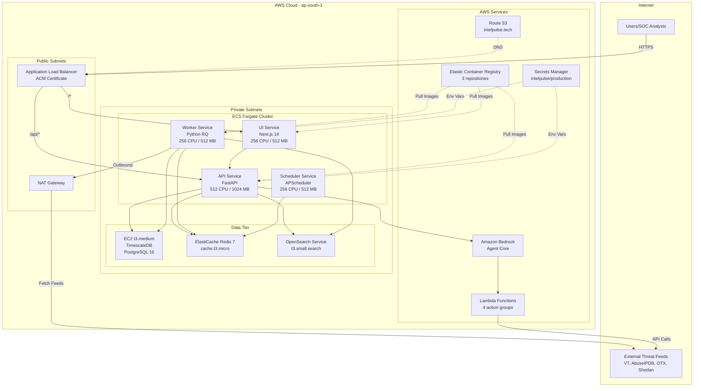
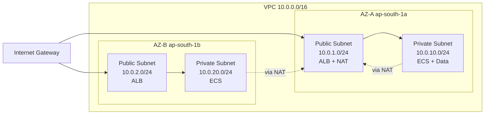
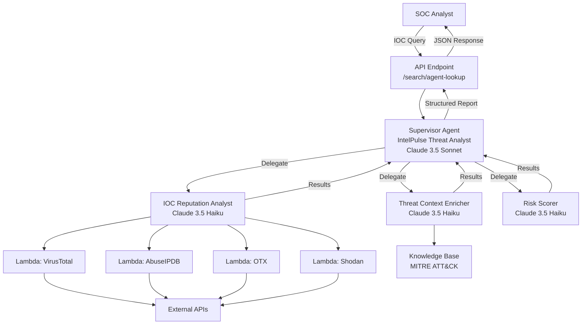

# Design Document: AWS Infrastructure Migration

## Overview

This design covers the complete migration of IntelPulse threat intelligence platform from a VPS-hosted Docker Compose deployment to AWS cloud infrastructure. The migration encompasses three major components: (1) Infrastructure modernization using AWS managed services (ECS Fargate, ElastiCache, OpenSearch, EC2 for TimescaleDB), (2) AI layer replacement with Amazon Bedrock Agent Core multi-agent system, and (3) CI/CD automation with GitHub Actions. The target architecture leverages AWS best practices while maintaining backward compatibility with local development workflows. This migration is designed for the AWS Codethon Theme 3 (Intelligent Multi-Agent Domain Solutions) and demonstrates extensive use of KIRO IDE, Amazon Q Developer, AWS Transform, and Bedrock Agent Core.

## Architecture

### High-Level System Architecture




### Network Architecture



### Bedrock Multi-Agent System




## Components and Interfaces

### Component 1: CDK Infrastructure Stack

**Purpose**: Define and provision all AWS resources using Infrastructure as Code

**Interface**:
```typescript
// infra/lib/intelpulse-stack.ts
export class IntelPulseStack extends cdk.Stack {
  public readonly vpc: ec2.Vpc;
  public readonly cluster: ecs.Cluster;
  public readonly alb: elbv2.ApplicationLoadBalancer;
  public readonly database: ec2.Instance;
  public readonly redis: elasticache.CfnCacheCluster;
  public readonly opensearch: opensearch.Domain;
  
  constructor(scope: Construct, id: string, props?: cdk.StackProps);
  
  private createVpc(): ec2.Vpc;
  private createSecurityGroups(): SecurityGroups;
  private createDatabase(): ec2.Instance;
  private createManagedServices(): ManagedServices;
  private createEcsCluster(): ecs.Cluster;
  private createFargateServices(): void;
  private createAlb(): elbv2.ApplicationLoadBalancer;
}

interface SecurityGroups {
  alb: ec2.SecurityGroup;
  ecs: ec2.SecurityGroup;
  postgres: ec2.SecurityGroup;
  redis: ec2.SecurityGroup;
  opensearch: ec2.SecurityGroup;
}

interface ManagedServices {
  redis: elasticache.CfnCacheCluster;
  opensearch: opensearch.Domain;
}
```

**Responsibilities**:
- Create VPC with 2 AZs, public/private subnets, NAT Gateway
- Provision EC2 instance for TimescaleDB with EBS volume
- Create ElastiCache Redis and OpenSearch Service
- Set up ECS Fargate cluster with 4 services
- Configure ALB with ACM certificate and routing rules
- Create ECR repositories for container images
- Set up IAM roles with least-privilege permissions
- Tag all resources: Project=IntelPulse, Environment=production


### Component 2: Bedrock Adapter Service

**Purpose**: Replace self-hosted llama3 HTTP calls with Amazon Bedrock API

**Interface**:
```python
# api/services/bedrock_adapter.py
from typing import Optional, Dict, Any
import boto3
import json

class BedrockAdapter:
    def __init__(self, region: str = "ap-south-1"):
        self.client = boto3.client("bedrock-runtime", region_name=region)
        self.default_model = "anthropic.claude-3-5-haiku-20241022"
    
    async def ai_analyze(
        self,
        prompt: str,
        system: str = "",
        model: Optional[str] = None,
        max_tokens: int = 2048
    ) -> str:
        """Invoke Bedrock model and return text response"""
        pass
    
    async def ai_analyze_structured(
        self,
        prompt: str,
        system: str = "",
        model: Optional[str] = None
    ) -> Dict[str, Any]:
        """Invoke Bedrock model and return parsed JSON response"""
        pass
    
    def _parse_json_response(self, text: str) -> Dict[str, Any]:
        """Extract JSON from response, handling code blocks"""
        pass
```

**Responsibilities**:
- Provide drop-in replacement for existing AI HTTP calls
- Handle Bedrock API authentication via boto3
- Parse and structure Bedrock responses
- Support both text and structured JSON outputs
- Maintain backward compatibility with local dev (llama3)


### Component 3: Bedrock Multi-Agent Service

**Purpose**: Orchestrate multi-agent IOC analysis using Bedrock Agent Core

**Interface**:
```python
# api/services/bedrock_agents.py
from typing import Dict, Any
from uuid import uuid4
import boto3
import os

class BedrockAgentService:
    def __init__(self):
        self.client = boto3.client("bedrock-agent-runtime", region_name="ap-south-1")
        self.supervisor_agent_id = os.getenv("BEDROCK_SUPERVISOR_AGENT_ID")
        self.supervisor_alias_id = os.getenv("BEDROCK_SUPERVISOR_ALIAS_ID")
    
    async def invoke_threat_analysis(
        self,
        ioc: str,
        ioc_type: str
    ) -> Dict[str, Any]:
        """Invoke multi-agent supervisor for comprehensive IOC analysis"""
        pass
    
    def _parse_agent_response(self, response_text: str) -> Dict[str, Any]:
        """Parse structured JSON from agent response"""
        pass
    
    def _extract_agent_trace(self, response: Dict) -> list:
        """Extract agent invocation trace for debugging"""
        pass

# Response schema
class ThreatAnalysisResponse:
    ioc: str
    ioc_type: str
    risk_score: int  # 0-100
    severity: str  # critical|high|medium|low|info
    confidence: int  # 0-100
    detections: Dict[str, Any]
    mitre_techniques: list[str]
    threat_actors: list[str]
    recommended_actions: list[str]
    agent_trace: list[Dict[str, Any]]
```

**Responsibilities**:
- Invoke Bedrock supervisor agent with IOC query
- Parse streaming agent responses
- Extract structured threat intelligence report
- Capture agent trace for transparency
- Handle errors with fallback to direct Bedrock calls


### Component 4: Lambda Action Groups

**Purpose**: Provide external API integration for Bedrock agents

**Interface**:
```python
# infra/lambdas/virustotal_lookup/handler.py
from typing import Dict, Any
import requests
import boto3
import json

def lambda_handler(event: Dict[str, Any], context: Any) -> Dict[str, Any]:
    """
    VirusTotal IOC lookup Lambda function
    
    Input: {"ioc": "8.8.8.8", "ioc_type": "ip"}
    Output: {"detections": 2, "total_engines": 89, "malicious": true, "details": {...}}
    """
    pass

# Similar interfaces for:
# - abuseipdb_check/handler.py
# - otx_lookup/handler.py  
# - shodan_lookup/handler.py
```

**Responsibilities**:
- Query external threat intelligence APIs
- Retrieve API keys from Secrets Manager
- Transform API responses to standardized format
- Handle rate limiting and errors
- Return structured data to Bedrock agents

### Component 5: ECS Task Definitions

**Purpose**: Define containerized application services

**Interface**:
```typescript
// infra/lib/ecs-services.ts
interface TaskDefinitionConfig {
  family: string;
  cpu: string;
  memory: string;
  image: string;
  port?: number;
  command?: string[];
  environment: { [key: string]: string };
  secrets: ecs.Secret[];
  healthCheck?: ecs.HealthCheck;
}

function createApiTask(config: TaskDefinitionConfig): ecs.FargateTaskDefinition;
function createUiTask(config: TaskDefinitionConfig): ecs.FargateTaskDefinition;
function createWorkerTask(config: TaskDefinitionConfig): ecs.FargateTaskDefinition;
function createSchedulerTask(config: TaskDefinitionConfig): ecs.FargateTaskDefinition;
```

**Responsibilities**:
- Define resource allocations (CPU, memory)
- Configure container images from ECR
- Inject environment variables from Secrets Manager
- Set up health checks and logging
- Configure IAM task roles


## Data Models

### Model 1: AWS Secrets Structure

```typescript
interface IntelPulseSecrets {
  // Core application
  SECRET_KEY: string;
  ENVIRONMENT: "production";
  LOG_LEVEL: "INFO" | "DEBUG" | "WARNING" | "ERROR";
  
  // Database
  POSTGRES_HOST: string;  // EC2 private IP
  POSTGRES_PORT: "5432";
  POSTGRES_DB: "ti_platform";
  POSTGRES_USER: "ti";
  POSTGRES_PASSWORD: string;
  
  // Cache & Search
  REDIS_URL: string;  // redis://<elasticache-endpoint>:6379/0
  OPENSEARCH_URL: string;  // https://<opensearch-domain>
  
  // Authentication
  GOOGLE_CLIENT_ID: string;
  GOOGLE_CLIENT_SECRET: string;
  DOMAIN: "intelpulse.tech";
  DOMAIN_UI: "https://intelpulse.tech";
  DOMAIN_API: "https://intelpulse.tech";
  JWT_EXPIRE_MINUTES: "480";
  
  // External APIs
  NVD_API_KEY: string;
  ABUSEIPDB_API_KEY: string;
  OTX_API_KEY: string;
  VIRUSTOTAL_API_KEY: string;
  SHODAN_API_KEY: string;
  
  // AWS Services
  AWS_REGION: "ap-south-1";
  BEDROCK_SUPERVISOR_AGENT_ID: string;
  BEDROCK_SUPERVISOR_ALIAS_ID: string;
}
```

**Validation Rules**:
- All API keys must be non-empty strings
- POSTGRES_PASSWORD must be at least 16 characters
- SECRET_KEY must be 64 hex characters (32 bytes)
- URLs must be valid HTTPS endpoints
- Agent IDs must match AWS Bedrock format


### Model 2: CDK Stack Configuration

```typescript
interface IntelPulseStackProps extends cdk.StackProps {
  env: {
    account: string;
    region: "ap-south-1";
  };
  vpcCidr: "10.0.0.0/16";
  availabilityZones: ["ap-south-1a", "ap-south-1b"];
  
  // Database
  databaseInstanceType: "t3.medium";
  databaseVolumeSize: 50;  // GB
  
  // Cache
  redisNodeType: "cache.t3.micro";
  
  // Search
  opensearchInstanceType: "t3.small.search";
  opensearchVersion: "2.13";
  
  // ECS
  apiCpu: 512;
  apiMemory: 1024;
  uiCpu: 256;
  uiMemory: 512;
  workerCpu: 256;
  workerMemory: 512;
  
  // Domain
  domainName: "intelpulse.tech";
  certificateArn?: string;
  
  // Tags
  tags: {
    Project: "IntelPulse";
    Environment: "production";
    ManagedBy: "CDK";
  };
}
```

**Validation Rules**:
- Region must be ap-south-1
- VPC CIDR must not overlap with existing VPCs
- Instance types must be available in selected AZs
- Domain name must be registered and verified
- Certificate ARN must be valid ACM certificate


### Model 3: Bedrock Agent Configuration

```typescript
interface BedrockAgentConfig {
  // Supervisor Agent
  supervisor: {
    name: "IntelPulse-Threat-Analyst";
    model: "anthropic.claude-3-5-sonnet-20241022";
    instruction: string;
    collaborationType: "SUPERVISOR";
    collaborators: string[];  // Agent IDs
  };
  
  // Collaborator Agents
  collaborators: {
    reputationAnalyst: {
      name: "IOC-Reputation-Analyst";
      model: "anthropic.claude-3-5-haiku-20241022";
      instruction: string;
      collaborationType: "COLLABORATOR";
      actionGroups: ["virustotal_lookup", "abuseipdb_check", "otx_lookup", "shodan_lookup"];
    };
    contextEnricher: {
      name: "Threat-Context-Enricher";
      model: "anthropic.claude-3-5-haiku-20241022";
      instruction: string;
      collaborationType: "COLLABORATOR";
      knowledgeBase: string;  // KB ID
    };
    riskScorer: {
      name: "Risk-Scorer";
      model: "anthropic.claude-3-5-haiku-20241022";
      instruction: string;
      collaborationType: "COLLABORATOR";
    };
  };
}
```

**Validation Rules**:
- Model IDs must be valid Bedrock foundation models
- Instructions must be under 4000 characters
- Action group names must match Lambda function names
- Knowledge base must exist and be accessible
- Collaborator agents must be created before supervisor


## Algorithmic Pseudocode

### Main Processing Algorithm: CDK Stack Deployment

```typescript
ALGORITHM deployIntelPulseStack(config: IntelPulseStackProps)
INPUT: config of type IntelPulseStackProps
OUTPUT: deployed AWS infrastructure

BEGIN
  ASSERT config.region = "ap-south-1"
  ASSERT config.vpcCidr = "10.0.0.0/16"
  
  // Step 1: Create VPC and networking
  vpc ← createVpc(config.vpcCidr, config.availabilityZones)
  securityGroups ← createSecurityGroups(vpc)
  
  // Step 2: Create data tier
  database ← createTimescaleDbInstance(vpc, securityGroups.postgres, config)
  redis ← createElastiCache(vpc, securityGroups.redis, config)
  opensearch ← createOpenSearch(vpc, securityGroups.opensearch, config)
  
  // Step 3: Create secrets
  secrets ← createSecretsManager(database, redis, opensearch)
  
  // Step 4: Create ECR repositories
  ecrRepos ← createEcrRepositories(["api", "ui", "worker"])
  
  // Step 5: Create ECS cluster and services
  cluster ← createEcsCluster(vpc)
  apiService ← createApiService(cluster, ecrRepos.api, secrets, securityGroups.ecs)
  uiService ← createUiService(cluster, ecrRepos.ui, securityGroups.ecs)
  workerService ← createWorkerService(cluster, ecrRepos.worker, secrets, securityGroups.ecs)
  schedulerService ← createSchedulerService(cluster, ecrRepos.worker, secrets, securityGroups.ecs)
  
  // Step 6: Create ALB and routing
  alb ← createApplicationLoadBalancer(vpc, securityGroups.alb, config.certificateArn)
  configureAlbRouting(alb, apiService, uiService)
  
  // Step 7: Create Route 53 records
  createDnsRecords(config.domainName, alb)
  
  ASSERT allServicesHealthy([apiService, uiService, workerService, schedulerService])
  
  RETURN {
    vpcId: vpc.id,
    albDns: alb.dnsName,
    clusterArn: cluster.arn,
    databaseEndpoint: database.privateIp
  }
END
```

**Preconditions:**
- AWS credentials configured with sufficient permissions
- CDK bootstrapped in target account and region
- Domain name registered and accessible
- ACM certificate requested and validated (if provided)

**Postconditions:**
- All AWS resources created and tagged
- VPC with proper subnet configuration
- ECS services running and healthy
- ALB routing traffic to services
- Secrets stored in Secrets Manager

**Loop Invariants:**
- All created resources maintain proper tagging
- Security groups enforce least-privilege access
- All services remain in private subnets except ALB


### Bedrock Agent Invocation Algorithm

```typescript
ALGORITHM invokeMultiAgentAnalysis(ioc: string, iocType: string)
INPUT: ioc (IP/domain/hash/URL), iocType (ip|domain|hash|url)
OUTPUT: structured threat analysis report

BEGIN
  ASSERT ioc IS NOT NULL AND ioc IS NOT EMPTY
  ASSERT iocType IN ["ip", "domain", "hash", "url"]
  
  // Step 1: Initialize Bedrock client
  client ← boto3.client("bedrock-agent-runtime", region="ap-south-1")
  sessionId ← generateUuid()
  
  // Step 2: Construct agent prompt
  prompt ← formatPrompt(
    "Analyze this {iocType} IOC: {ioc}. " +
    "Query all available threat intelligence sources and provide " +
    "a comprehensive risk assessment."
  )
  
  // Step 3: Invoke supervisor agent
  response ← client.invokeAgent(
    agentId=SUPERVISOR_AGENT_ID,
    agentAliasId=SUPERVISOR_ALIAS_ID,
    sessionId=sessionId,
    inputText=prompt
  )
  
  // Step 4: Parse streaming response
  resultText ← ""
  FOR EACH event IN response.completion DO
    IF event CONTAINS "chunk" THEN
      resultText ← resultText + event.chunk.bytes.decode("utf-8")
    END IF
  END FOR
  
  // Step 5: Extract structured data
  analysis ← parseJsonFromText(resultText)
  
  ASSERT analysis.risk_score >= 0 AND analysis.risk_score <= 100
  ASSERT analysis.severity IN ["critical", "high", "medium", "low", "info"]
  ASSERT analysis.confidence >= 0 AND analysis.confidence <= 100
  
  RETURN analysis
END
```

**Preconditions:**
- Bedrock supervisor agent created and deployed
- Agent alias exists and is active
- IAM role has bedrock:InvokeAgent permission
- Environment variables BEDROCK_SUPERVISOR_AGENT_ID and BEDROCK_SUPERVISOR_ALIAS_ID set

**Postconditions:**
- Returns structured JSON with risk assessment
- risk_score is integer 0-100
- severity is one of: critical, high, medium, low, info
- confidence is integer 0-100
- agent_trace contains invocation history

**Loop Invariants:**
- All streamed chunks are UTF-8 decodable
- Accumulated text remains valid during streaming


### Lambda Action Group Algorithm

```python
ALGORITHM virusTotalLookup(ioc: string, iocType: string)
INPUT: ioc (indicator), iocType (ip|domain|hash|url)
OUTPUT: VirusTotal detection results

BEGIN
  ASSERT ioc IS NOT NULL
  ASSERT iocType IN ["ip", "domain", "hash", "url"]
  
  // Step 1: Retrieve API key from Secrets Manager
  secretsClient ← boto3.client("secretsmanager", region="ap-south-1")
  secrets ← secretsClient.getSecretValue(secretId="intelpulse/production")
  apiKey ← parseJson(secrets.SecretString).VIRUSTOTAL_API_KEY
  
  // Step 2: Determine API endpoint
  endpoint ← MATCH iocType WITH
    CASE "ip" → "https://www.virustotal.com/api/v3/ip_addresses/{ioc}"
    CASE "domain" → "https://www.virustotal.com/api/v3/domains/{ioc}"
    CASE "hash" → "https://www.virustotal.com/api/v3/files/{ioc}"
    CASE "url" → "https://www.virustotal.com/api/v3/urls/{base64(ioc)}"
  END MATCH
  
  // Step 3: Call VirusTotal API
  headers ← {"x-apikey": apiKey}
  response ← httpGet(endpoint, headers=headers, timeout=25)
  
  IF response.statusCode != 200 THEN
    RETURN {
      "error": true,
      "message": "VirusTotal API error",
      "statusCode": response.statusCode
    }
  END IF
  
  // Step 4: Parse and transform response
  data ← parseJson(response.body)
  stats ← data.data.attributes.last_analysis_stats
  
  result ← {
    "detections": stats.malicious,
    "total_engines": stats.malicious + stats.suspicious + stats.undetected + stats.harmless,
    "malicious": stats.malicious > 0,
    "details": {
      "malicious": stats.malicious,
      "suspicious": stats.suspicious,
      "undetected": stats.undetected,
      "harmless": stats.harmless,
      "reputation": data.data.attributes.reputation,
      "last_analysis_date": data.data.attributes.last_analysis_date
    }
  }
  
  ASSERT result.detections >= 0
  ASSERT result.total_engines > 0
  
  RETURN result
END
```

**Preconditions:**
- Lambda has IAM permission secretsmanager:GetSecretValue
- VIRUSTOTAL_API_KEY exists in Secrets Manager
- IOC format is valid for its type
- VirusTotal API is accessible

**Postconditions:**
- Returns structured detection data
- detections count is non-negative
- total_engines is positive
- malicious boolean matches detections > 0

**Loop Invariants:** N/A (no loops in main logic)


## Key Functions with Formal Specifications

### Function 1: createVpc()

```typescript
function createVpc(
  cidr: string,
  azs: string[],
  natGateways: number = 1
): ec2.Vpc
```

**Preconditions:**
- `cidr` is valid CIDR notation (e.g., "10.0.0.0/16")
- `azs` contains at least 2 availability zones
- `natGateways` is 1 or 2 (for cost optimization)

**Postconditions:**
- Returns VPC with specified CIDR
- VPC has 2 public subnets (one per AZ)
- VPC has 2 private subnets (one per AZ)
- NAT Gateway(s) created in public subnet(s)
- Internet Gateway attached to VPC
- Route tables configured for public/private routing

**Loop Invariants:** N/A


### Function 2: createTimescaleDbInstance()

```typescript
function createTimescaleDbInstance(
  vpc: ec2.Vpc,
  securityGroup: ec2.SecurityGroup,
  config: DatabaseConfig
): ec2.Instance
```

**Preconditions:**
- `vpc` is valid and deployed
- `securityGroup` allows inbound 5432 from ECS security group
- `config.instanceType` is valid EC2 instance type
- `config.volumeSize` is at least 20 GB

**Postconditions:**
- Returns EC2 instance in private subnet
- Instance has EBS gp3 volume attached
- Docker installed via user data script
- TimescaleDB container running on port 5432
- db/schema.sql executed as initialization
- Instance tagged with Project=IntelPulse

**Loop Invariants:** N/A


### Function 3: invokeAgent()

```python
async def invoke_threat_analysis(
    ioc: str,
    ioc_type: str
) -> Dict[str, Any]
```

**Preconditions:**
- `ioc` is non-empty string
- `ioc_type` is one of: "ip", "domain", "hash", "url"
- BEDROCK_SUPERVISOR_AGENT_ID environment variable set
- BEDROCK_SUPERVISOR_ALIAS_ID environment variable set
- IAM role has bedrock:InvokeAgent permission

**Postconditions:**
- Returns dictionary with keys: ioc, ioc_type, risk_score, severity, confidence, detections, mitre_techniques, threat_actors, recommended_actions, agent_trace
- risk_score is integer 0-100
- severity is one of: "critical", "high", "medium", "low", "info"
- confidence is integer 0-100
- agent_trace is list of agent invocations

**Loop Invariants:**
- For streaming response loop: accumulated text remains valid UTF-8
- All chunks are successfully decoded


### Function 4: createFargateService()

```typescript
function createFargateService(
  cluster: ecs.Cluster,
  taskDefinition: ecs.FargateTaskDefinition,
  targetGroup?: elbv2.ApplicationTargetGroup,
  desiredCount: number = 1
): ecs.FargateService
```

**Preconditions:**
- `cluster` is valid ECS cluster
- `taskDefinition` has valid container definitions
- If `targetGroup` provided, it must be attached to ALB
- `desiredCount` is at least 1

**Postconditions:**
- Returns Fargate service running in private subnets
- Service has desired count of tasks running
- If targetGroup provided, service registered with target group
- Service has CloudWatch logging enabled
- Service has proper IAM task execution role

**Loop Invariants:** N/A


## Example Usage

### Example 1: Deploy CDK Stack

```typescript
// infra/bin/intelpulse.ts
import * as cdk from 'aws-cdk-lib';
import { IntelPulseStack } from '../lib/intelpulse-stack';

const app = new cdk.App();

new IntelPulseStack(app, 'IntelPulseStack', {
  env: {
    account: process.env.CDK_DEFAULT_ACCOUNT,
    region: 'ap-south-1'
  },
  vpcCidr: '10.0.0.0/16',
  availabilityZones: ['ap-south-1a', 'ap-south-1b'],
  databaseInstanceType: 't3.medium',
  databaseVolumeSize: 50,
  redisNodeType: 'cache.t3.micro',
  opensearchInstanceType: 't3.small.search',
  opensearchVersion: '2.13',
  apiCpu: 512,
  apiMemory: 1024,
  uiCpu: 256,
  uiMemory: 512,
  workerCpu: 256,
  workerMemory: 512,
  domainName: 'intelpulse.tech',
  tags: {
    Project: 'IntelPulse',
    Environment: 'production',
    ManagedBy: 'CDK'
  }
});

app.synth();
```

### Example 2: Invoke Bedrock Agent from API

```python
# api/routes/search.py
from fastapi import APIRouter, HTTPException
from pydantic import BaseModel
from api.services.bedrock_agents import BedrockAgentService

router = APIRouter()
agent_service = BedrockAgentService()

class AgentLookupRequest(BaseModel):
    ioc: str
    ioc_type: str

@router.post("/search/agent-lookup")
async def agent_lookup(request: AgentLookupRequest):
    """Multi-agent IOC analysis using Bedrock Agent Core"""
    try:
        result = await agent_service.invoke_threat_analysis(
            ioc=request.ioc,
            ioc_type=request.ioc_type
        )
        return {
            "status": "success",
            "analysis": result,
            "engine": "bedrock-multi-agent"
        }
    except Exception as e:
        raise HTTPException(status_code=500, detail=str(e))
```


### Example 3: Lambda Action Group Handler

```python
# infra/lambdas/virustotal_lookup/handler.py
import json
import boto3
import requests
from typing import Dict, Any

def lambda_handler(event: Dict[str, Any], context: Any) -> Dict[str, Any]:
    """VirusTotal IOC lookup for Bedrock agent"""
    
    # Extract parameters from Bedrock agent
    ioc = event['ioc']
    ioc_type = event['ioc_type']
    
    # Get API key from Secrets Manager
    secrets_client = boto3.client('secretsmanager', region_name='ap-south-1')
    secret = secrets_client.get_secret_value(SecretId='intelpulse/production')
    api_key = json.loads(secret['SecretString'])['VIRUSTOTAL_API_KEY']
    
    # Determine endpoint
    endpoints = {
        'ip': f'https://www.virustotal.com/api/v3/ip_addresses/{ioc}',
        'domain': f'https://www.virustotal.com/api/v3/domains/{ioc}',
        'hash': f'https://www.virustotal.com/api/v3/files/{ioc}',
        'url': f'https://www.virustotal.com/api/v3/urls/{ioc}'
    }
    
    # Call VirusTotal API
    response = requests.get(
        endpoints[ioc_type],
        headers={'x-apikey': api_key},
        timeout=25
    )
    
    if response.status_code != 200:
        return {
            'error': True,
            'message': f'VirusTotal API error: {response.status_code}'
        }
    
    # Parse response
    data = response.json()
    stats = data['data']['attributes']['last_analysis_stats']
    
    return {
        'detections': stats['malicious'],
        'total_engines': sum(stats.values()),
        'malicious': stats['malicious'] > 0,
        'details': stats
    }
```


### Example 4: GitHub Actions CI/CD Workflow

```yaml
# .github/workflows/deploy-aws.yml
name: Deploy to AWS ECS

on:
  push:
    branches: [aws-codethon]

env:
  AWS_REGION: ap-south-1
  ECR_REGISTRY: ${{ secrets.AWS_ACCOUNT_ID }}.dkr.ecr.ap-south-1.amazonaws.com

jobs:
  deploy:
    runs-on: ubuntu-latest
    steps:
      - name: Checkout code
        uses: actions/checkout@v3
      
      - name: Configure AWS credentials
        uses: aws-actions/configure-aws-credentials@v2
        with:
          aws-access-key-id: ${{ secrets.AWS_ACCESS_KEY_ID }}
          aws-secret-access-key: ${{ secrets.AWS_SECRET_ACCESS_KEY }}
          aws-region: ${{ env.AWS_REGION }}
      
      - name: Login to ECR
        run: |
          aws ecr get-login-password --region $AWS_REGION | \
          docker login --username AWS --password-stdin $ECR_REGISTRY
      
      - name: Build and push API image
        run: |
          docker build -f docker/Dockerfile.api -t $ECR_REGISTRY/intelpulse/api:${{ github.sha }} .
          docker tag $ECR_REGISTRY/intelpulse/api:${{ github.sha }} $ECR_REGISTRY/intelpulse/api:latest
          docker push $ECR_REGISTRY/intelpulse/api:${{ github.sha }}
          docker push $ECR_REGISTRY/intelpulse/api:latest
      
      - name: Update ECS service
        run: |
          aws ecs update-service \
            --cluster intelpulse-production \
            --service intelpulse-api \
            --force-new-deployment \
            --region $AWS_REGION
```


## Correctness Properties

### Property 1: VPC Network Isolation
**Universal Quantification**: ∀ resource ∈ DataTier, resource.subnet.type = "private" ∧ resource.securityGroup.inbound ⊆ EcsSecurityGroup

All data tier resources (TimescaleDB, Redis, OpenSearch) must be in private subnets and only accept inbound traffic from ECS security group.

### Property 2: Secrets Never Hardcoded
**Universal Quantification**: ∀ file ∈ SourceCode, ¬∃ pattern ∈ file.content where pattern matches /[A-Z_]+_API_KEY\s*=\s*["'][^"']+["']/

No source code files contain hardcoded API keys or secrets. All secrets must be retrieved from AWS Secrets Manager.

### Property 3: Agent Response Validity
**Universal Quantification**: ∀ response ∈ AgentResponses, (response.risk_score ≥ 0 ∧ response.risk_score ≤ 100) ∧ response.severity ∈ {"critical", "high", "medium", "low", "info"} ∧ (response.confidence ≥ 0 ∧ response.confidence ≤ 100)

All Bedrock agent responses must have valid risk scores (0-100), severity levels from defined set, and confidence scores (0-100).

### Property 4: ECS Task Health
**Universal Quantification**: ∀ service ∈ EcsServices, service.runningCount ≥ service.desiredCount ∧ ∀ task ∈ service.tasks, task.healthStatus = "HEALTHY"

All ECS services must maintain desired task count and all tasks must pass health checks.

### Property 5: ALB Routing Correctness
**Universal Quantification**: ∀ request ∈ HttpRequests, (request.path.startsWith("/api/") ⟹ route(request) = ApiTargetGroup) ∧ (¬request.path.startsWith("/api/") ⟹ route(request) = UiTargetGroup)

All HTTP requests to /api/* must route to API target group, all other requests to UI target group.

### Property 6: Lambda Timeout Safety
**Universal Quantification**: ∀ lambda ∈ ActionGroupLambdas, lambda.timeout ≤ 30 ∧ lambda.apiCallTimeout < lambda.timeout - 5

All Lambda functions must have 30s timeout and API calls must timeout at least 5s before Lambda timeout.

### Property 7: IAM Least Privilege
**Universal Quantification**: ∀ role ∈ IamRoles, ∀ permission ∈ role.permissions, ∃ resource ∈ role.resources where resource.requires(permission)

All IAM permissions must be justified by actual resource requirements (least privilege principle).

### Property 8: Multi-AZ Redundancy
**Universal Quantification**: ∀ service ∈ [ApiService, UiService], ∃ task₁, task₂ ∈ service.tasks where task₁.availabilityZone ≠ task₂.availabilityZone

Critical services (API, UI) must have tasks running in multiple availability zones.


## Error Handling

### Error Scenario 1: CDK Deployment Failure

**Condition**: CDK stack deployment fails due to resource limits or permissions
**Response**: 
- CDK automatically rolls back all created resources
- CloudFormation stack enters ROLLBACK_COMPLETE state
- Error details logged to CloudWatch

**Recovery**:
- Review CloudFormation events for specific failure reason
- Adjust resource configurations or request limit increases
- Delete failed stack: `cdk destroy`
- Retry deployment: `cdk deploy`

### Error Scenario 2: Bedrock Agent Invocation Timeout

**Condition**: Agent takes longer than 30s to respond or external APIs timeout
**Response**:
- Catch boto3 timeout exception
- Log error with IOC and timestamp
- Return fallback response using direct Bedrock call (non-agent)

**Recovery**:
- Fallback provides basic analysis without multi-agent orchestration
- User sees "fallback" status in response
- System remains operational with degraded AI capabilities

### Error Scenario 3: ECS Task Failure

**Condition**: ECS task fails health check or crashes
**Response**:
- ECS automatically stops failed task
- ECS launches replacement task
- ALB removes failed task from target group
- CloudWatch alarm triggers if failure rate exceeds threshold

**Recovery**:
- Check CloudWatch logs for task failure reason
- If image issue: rebuild and push new image
- If configuration issue: update task definition
- ECS automatically maintains desired count

### Error Scenario 4: Lambda Action Group API Error

**Condition**: External API (VirusTotal, AbuseIPDB) returns error or rate limit
**Response**:
- Lambda catches HTTP error
- Returns structured error response to Bedrock agent
- Agent continues with available data from other sources

**Recovery**:
- Agent synthesizes report with partial data
- Marks affected data source as unavailable in response
- Recommends manual verification if critical source failed


### Error Scenario 5: Secrets Manager Access Denied

**Condition**: ECS task or Lambda cannot retrieve secrets due to IAM permissions
**Response**:
- Application fails to start or Lambda returns error
- CloudWatch logs show "AccessDeniedException"
- ECS task enters STOPPED state with exit code 1

**Recovery**:
- Update IAM task execution role with secretsmanager:GetSecretValue permission
- Ensure secret ARN matches in IAM policy
- Restart ECS service or retry Lambda invocation

### Error Scenario 6: Database Connection Failure

**Condition**: API cannot connect to TimescaleDB on EC2
**Response**:
- SQLAlchemy raises connection timeout
- API health check fails
- ALB marks API tasks as unhealthy

**Recovery**:
- Verify EC2 instance is running
- Check security group allows 5432 from ECS security group
- Verify POSTGRES_HOST in secrets matches EC2 private IP
- Check TimescaleDB container is running on EC2
- Restart API service after fixing issue

## Testing Strategy

### Unit Testing Approach

**Python Backend Tests**:
- Use pytest with async support (pytest-asyncio)
- Mock boto3 clients for Bedrock and Secrets Manager
- Test Bedrock adapter with mocked responses
- Test agent service with mocked streaming responses
- Test Lambda handlers with sample event payloads
- Coverage target: 80% for new code

**TypeScript CDK Tests**:
- Use AWS CDK assertions library
- Test stack synthesizes without errors
- Verify resource properties (instance types, CIDR blocks)
- Verify security group rules
- Verify IAM policies follow least privilege
- Test tag propagation to all resources

### Property-Based Testing Approach

**Property Test Library**: hypothesis (Python), fast-check (TypeScript)

**Property Tests for Bedrock Adapter**:
- Property: All valid IOC types return structured response
- Property: Risk scores always in range 0-100
- Property: Severity always in defined set
- Property: Confidence always in range 0-100

**Property Tests for Lambda Handlers**:
- Property: All valid IOC inputs return non-error response
- Property: API errors return structured error format
- Property: Response time under 25 seconds

**Property Tests for CDK Stack**:
- Property: All resources have required tags
- Property: All private resources in private subnets
- Property: All security groups follow least privilege


### Integration Testing Approach

**Infrastructure Integration Tests**:
- Deploy CDK stack to test AWS account
- Verify all services reach healthy state
- Test ALB routing with curl commands
- Verify database connectivity from API
- Test secrets retrieval from all services
- Cleanup: destroy stack after tests

**Bedrock Agent Integration Tests**:
- Create test agent with minimal configuration
- Invoke agent with sample IOCs
- Verify response structure matches schema
- Test all 4 Lambda action groups independently
- Test agent collaboration flow
- Measure end-to-end latency

**End-to-End Tests**:
- Deploy full stack to staging environment
- Test complete user flow: login → search → agent analysis
- Verify UI displays agent results correctly
- Test feed ingestion and worker processing
- Load test with 100 concurrent IOC lookups
- Monitor CloudWatch metrics during test

## Performance Considerations

**API Response Time**:
- Target: p95 < 500ms for standard searches
- Target: p95 < 5s for agent-based analysis
- Optimization: Redis caching for frequent IOCs
- Optimization: OpenSearch query optimization

**Bedrock Agent Latency**:
- Expected: 3-8s for multi-agent analysis
- Mitigation: Show loading state with progress indicators
- Mitigation: Cache agent results for 1 hour
- Fallback: Direct Bedrock call if agent timeout

**ECS Task Scaling**:
- API service: Auto-scale 1-4 tasks based on CPU > 70%
- Worker service: Fixed 1 task (background processing)
- UI service: Fixed 1 task (low traffic expected)
- Scheduler service: Fixed 1 task (singleton)

**Database Performance**:
- TimescaleDB hypertables for time-series IOC data
- Indexes on: ioc_value, ioc_type, severity, created_at
- Retention policy: 90 days for raw IOC data
- EC2 t3.medium provides 2 vCPU, 4 GB RAM (sufficient for codethon)

**Cost Optimization**:
- Single NAT Gateway (not multi-AZ) saves $45/month
- t3.small.search for OpenSearch (not m5.large) saves $100/month
- cache.t3.micro for Redis (not cache.m5.large) saves $80/month
- Fargate Spot for worker tasks saves 70% on compute
- Total estimated cost: ~$200/month


## Security Considerations

**Network Security**:
- All data tier resources in private subnets (no public IPs)
- Security groups enforce least-privilege access
- ALB terminates TLS with ACM certificate
- NAT Gateway for outbound traffic only (no inbound)
- VPC Flow Logs enabled for network monitoring

**Secrets Management**:
- All secrets stored in AWS Secrets Manager
- Secrets encrypted at rest with KMS
- IAM policies restrict secret access to specific services
- Secrets rotation enabled for database passwords
- No secrets in source code or environment variables (except ARNs)

**IAM Security**:
- Separate IAM roles for each ECS service
- Task execution role: minimal permissions (ECR pull, logs, secrets)
- Task role: service-specific permissions (Bedrock, Secrets Manager)
- Lambda execution role: only required API permissions
- No wildcard (*) permissions in production policies

**API Security**:
- Google OAuth for user authentication
- JWT tokens with 8-hour expiration
- Rate limiting: 100 requests/minute per IP
- CORS restricted to intelpulse.tech domain
- Input validation on all API endpoints

**Bedrock Security**:
- Agent instructions prevent prompt injection
- Lambda action groups validate input parameters
- External API keys retrieved from Secrets Manager
- Agent responses sanitized before returning to user
- Agent trace logged for audit purposes

**Compliance**:
- CloudWatch Logs retention: 30 days
- VPC Flow Logs for network audit
- CloudTrail enabled for API audit
- Amazon Q security scans for code vulnerabilities
- Regular dependency updates via AWS Transform

## Dependencies

**AWS Services**:
- Amazon VPC (networking)
- Amazon EC2 (TimescaleDB host)
- Amazon ECS Fargate (container orchestration)
- Amazon ECR (container registry)
- Elastic Load Balancing (ALB)
- Amazon ElastiCache (Redis)
- Amazon OpenSearch Service
- AWS Secrets Manager
- Amazon Bedrock (Agent Core, Claude models)
- AWS Lambda (action groups)
- Amazon Route 53 (DNS)
- AWS Certificate Manager (TLS certificates)
- Amazon CloudWatch (logs, metrics, alarms)
- AWS IAM (access control)

**External Services**:
- VirusTotal API v3
- AbuseIPDB API v2
- AlienVault OTX API
- Shodan API
- NVD API (NIST)
- Google OAuth 2.0

**Development Tools**:
- KIRO IDE (spec creation, agentic development)
- Amazon Q Developer (security scans, code suggestions)
- AWS Transform (modernization assessment)
- AWS CDK (infrastructure as code)
- GitHub Actions (CI/CD)
- Docker (containerization)

**Runtime Dependencies**:
- Python 3.12 (API, worker, Lambda)
- Node.js 20 (UI, CDK)
- PostgreSQL 16 + TimescaleDB extension
- Redis 7
- OpenSearch 2.13
