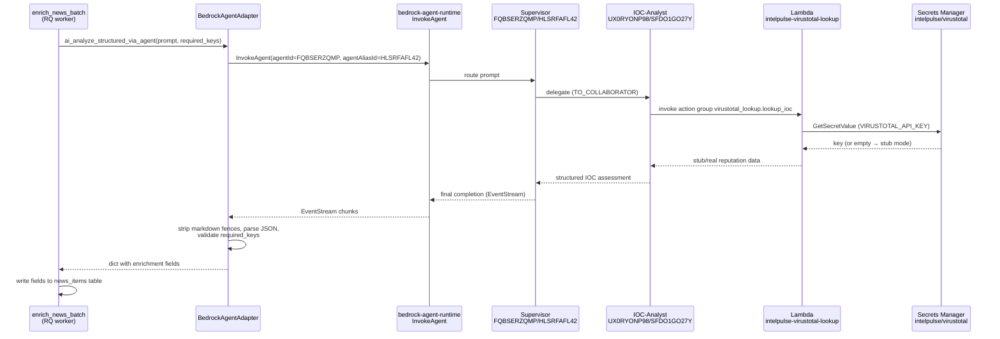

# IntelPulse — Technical Architecture

## Wipro × AWS Codeathon — Theme 3: Intelligent Multi-Agent Domain Solutions

---

## System Overview

IntelPulse is a production-grade threat intelligence platform that aggregates IOCs from 13+ external feeds, enriches them with AI analysis via Amazon Bedrock, and provides SOC analysts with searchable, actionable intelligence through a web dashboard. The platform was developed entirely using KIRO IDE and Amazon Q Developer.

## Architecture Diagram

```text
┌─────────────────────────────────────────────────────────────────┐
│                        Users / SOC Analysts                      │
│                    http://3.87.235.189:3000                       │
└──────────────────────────┬──────────────────────────────────────┘
                           │ HTTP
                           ▼
┌──────────────────────────────────────────────────────────────────┐
│                    EC2 Instance (t3.small)                        │
│                    3.87.235.189 / us-east-1                       │
│                                                                   │
│  ┌───────────────────┐          ┌───────────────────┐            │
│  │  Next.js UI :3000 │          │  FastAPI API :8000 │            │
│  │  TypeScript        │  ◄────► │  Python 3.12       │            │
│  │  Tailwind CSS      │          │  Async + Pydantic  │            │
│  │  Recharts + Zustand│          │  Bedrock Adapter   │            │
│  └───────────────────┘          └────────┬──────────┘            │
│                                           │                       │
│  ┌────────────────────────────────────────┼──────────────────┐   │
│  │              Docker Compose Services    │                  │   │
│  │  ┌──────────────────┐  ┌──────────────┐│                  │   │
│  │  │  PostgreSQL 16    │  │   Redis 7    ││                  │   │
│  │  │  + TimescaleDB    │  │  Sessions    ││                  │   │
│  │  │  (time-series DB) │  │  Cache, RQ   ││                  │   │
│  │  └──────────────────┘  └──────────────┘│                  │   │
│  └────────────────────────────────────────┘                  │   │
└───────────────────────────────────────────┼──────────────────────┘
                                            │ boto3 SDK
                                            ▼
┌──────────────────────────────────────────────────────────────────┐
│                        AWS Services                               │
│                                                                   │
│  ┌────────────────────────┐  ┌────────────────────────────────┐  │
│  │   Amazon Bedrock        │  │   IAM                          │  │
│  │   Claude 3 Haiku        │  │   BedrockAccessRole            │  │
│  │   (AI threat analysis)  │  │   (least-privilege policies)   │  │
│  └────────────────────────┘  └────────────────────────────────┘  │
│                                                                   │
│  ┌────────────────────────┐  ┌────────────────────────────────┐  │
│  │   AWS CDK               │  │   EC2                          │  │
│  │   Infrastructure as Code│  │   t3.small, us-east-1          │  │
│  └────────────────────────┘  └────────────────────────────────┘  │
└──────────────────────────────────────────────────────────────────┘
                           │
                           ▼
┌──────────────────────────────────────────────────────────────────┐
│                    External Threat Feeds                          │
│  NVD, CISA KEV, AbuseIPDB, VirusTotal, Shodan, OTX,             │
│  ThreatFox, URLhaus, MalwareBazaar, MITRE ATT&CK,               │
│  ExploitDB, CISA Advisories                                      │
└──────────────────────────────────────────────────────────────────┘
```

## Technology Stack

| Layer | Technology | Purpose |
|-------|-----------|---------|
| Frontend | Next.js 14, TypeScript, Tailwind CSS, Recharts, Zustand | SOC analyst dashboard |
| Backend | Python 3.12, FastAPI (async), Pydantic v2 | REST API |
| Database | PostgreSQL 16 + TimescaleDB | Time-series intel storage |
| Cache | Redis 7 | Sessions, caching, job queue |
| AI | Amazon Bedrock (Nova Lite + Bedrock Agents) | Threat analysis, IOC enrichment, multi-agent orchestration |
| Infra | Docker Compose on EC2 | Container orchestration |
| IaC | AWS CDK (TypeScript) | Infrastructure as Code |
| Dev Tools | KIRO IDE, Amazon Q Developer | AI-assisted development |

## AWS Services Integration

### Amazon Bedrock

The platform uses Amazon Bedrock for AI-powered threat analysis via a **multi-agent orchestration** path (when `AI_USE_AGENTS=true`) and a single-shot `invoke_model` fallback (default).

- **Foundation model**: `amazon.nova-lite-v1:0` (all agents)
- **Integration**: `BedrockAgentAdapter` (agent path) and `BedrockAdapter` (single-shot fallback)
- **Authentication**: IAM role attached to EC2 instance with `bedrock:InvokeAgent` and `bedrock:InvokeModel` permissions
- **Endpoints**:
  - `POST /api/v1/demo/analyze` — IOC threat analysis
  - `GET /api/v1/demo/health` — Bedrock health check

> **Note**: Anthropic Claude models (`anthropic.claude-*`) return `INVALID_PAYMENT_INSTRUMENT` on this AWS account. All inference uses Amazon Nova Lite.

### Bedrock Adapter Architecture

```text
API Request → BedrockAdapter → boto3.client('bedrock-runtime')
                                    │
                                    ▼
                            Amazon Bedrock
                            amazon.nova-lite-v1:0 (invoke_model)
                                    │
                                    ▼
                            Structured JSON Response
                            (risk_score, severity, MITRE techniques)
```

The single-shot adapter supports:

- Text generation (`ai_analyze`)
- Structured JSON generation (`ai_analyze_structured`)
- Health checks (`check_health`)
- Automatic response parsing with markdown fence stripping

### Multi-Agent Design

**LIVE as of 2026-04-17 (commit 6b768a6).** The platform provisions and routes through a supervisor-router + collaborator pattern using Bedrock Agents.

#### Live Agent Catalog

| Agent | Agent ID | Alias ID | Foundation Model | Mode |
| ----- | -------- | -------- | ---------------- | ---- |
| **IntelPulse-Threat-Analyst** (Supervisor) | `FQBSERZQMP` | `HLSRFAFL42` (`live-v2`) | `amazon.nova-lite-v1:0` | `SUPERVISOR_ROUTER` |
| **IOC-Analyst** | `UX0RYONP98` | `SFDO1GO27Y` (`live`) | `amazon.nova-lite-v1:0` | Collaborator |
| **Risk-Scorer** | `WH4N4SUKMB` | `BP6KQNKDUB` (`live`) | `amazon.nova-lite-v1:0` | Collaborator |

Collaborator wiring: Supervisor → IOC-Analyst (`TO_COLLABORATOR`), Supervisor → Risk-Scorer (`TO_COLLABORATOR`).

**Deferred (follow-up PR):** Threat Context Enricher (requires Bedrock Knowledge Base + MITRE ATT&CK data upload to S3).

#### Lambda Action Groups (Live)

| Lambda | Action Group | Status |
|--------|-------------|--------|
| `intelpulse-virustotal-lookup` | `virustotal_lookup` on IOC-Analyst | **LIVE** — Python 3.12, stdlib urllib only; stub mode active (no API key yet) |
| `abuseipdb_check` | — | Coded in `infra/lambdas/` but **not deployed** |
| `otx_lookup` | — | Coded in `infra/lambdas/` but **not deployed** |
| `shodan_lookup` | — | Coded in `infra/lambdas/` but **not deployed** |

IAM role for the live Lambda: `intelpulse-virustotal-lookup-role` (Lambda trust + CloudWatch Logs + `secretsmanager:GetSecretValue` on `intelpulse/virustotal`).

CloudWatch log group: `/aws/lambda/intelpulse-virustotal-lookup` (14-day retention).

#### News Enrichment Flow



#### Concrete Smoke-Test Results

Direct invoke to IOC-Analyst `live` — prompt `"Analyze IOC 8.8.8.8"`:
- 1 action group invocation (`virustotal_lookup.lookup_ioc`)
- Stub reputation data returned from Lambda
- Agent produced: `{"ioc": "8.8.8.8", "ioc_type": "ip", "reputation": "...", ...}`

Supervisor `live-v2` — prompt `"Check IP 185.220.101.45 in VirusTotal"`:
- 1 action group invocation through collaboration tree
- Final output: structured JSON with `reputation: malicious`

#### Known Caveats

- **Output cap**: Agent inference config caps output at 1024 tokens. The full 30-field news-enrichment JSON may truncate; only `category`, `summary`, and `executive_brief` are strictly required. Bumping to 4096 requires overriding the full agent prompt template — deferred.
- **Nova content filter**: Refuses approximately 20% of threat-intel content. Failed items are retried by the `re_enrich_fallback_news` scheduled task.
- **Latency**: Agent path is 3–5x slower than single-shot `invoke_model`.
- **Cost**: Roughly 5–8x per article (1 supervisor call + 1–2 collaborator rounds + up to 1 Lambda action-group call).

#### Enabling the Agent Path

The agent path is off by default (`AI_USE_AGENTS=false`). To enable on EC2:

```bash
echo 'AI_USE_AGENTS=true' >> /home/ubuntu/IntelPulse/.env
docker compose -f /home/ubuntu/IntelPulse/docker-compose.yml restart worker scheduler
# Verify:
docker logs intelpulse-worker-1 --tail 200 | grep bedrock_invoke_agent_request
```

See [`docs/MULTI_AGENT.md`](MULTI_AGENT.md) for the full deep-dive reference.

## Data Flow

### 1. Feed Ingestion Pipeline

```text
External Feed → Feed Connector → Normalize → Score → Store (PostgreSQL)
                                                    → Index (search)
```

12 feed connectors fetch data from external sources, normalize it into a common schema, calculate risk scores, and store in PostgreSQL with TimescaleDB hypertables.

### 2. AI Enrichment Pipeline

```text
IOC/News Item → Bedrock Adapter → Claude 3 Haiku → Structured Analysis
                                                  → Risk Score
                                                  → MITRE Techniques
                                                  → Recommendations
```

Amazon Bedrock enriches threat data with:

- Structured threat summaries
- Risk scoring (0-100)
- MITRE ATT&CK technique mapping
- Actionable security recommendations

### 3. User Query Flow

```text
SOC Analyst → UI Dashboard → API → PostgreSQL → Aggregated Results
           → IOC Search → API → Full-text Search → Filtered Results
           → AI Analysis → API → Bedrock → Threat Assessment
```

## Database Schema

### Core Tables

| Table | Purpose | Key Fields |
|-------|---------|------------|
| `intel_items` | Threat intelligence items | title, description, severity, risk_score, feed_source |
| `iocs` | Indicators of Compromise | value, type (ip/domain/hash/url), severity |
| `news_articles` | Cyber news with AI enrichment | title, content, ai_summary, risk_score |
| `mitre_techniques` | MITRE ATT&CK framework | technique_id, name, tactic, description |
| `cases` | Incident management | title, status, priority, assignee |
| `users` | Authentication | email, name, role, google_id |

### TimescaleDB Hypertables

IOC data uses TimescaleDB hypertables for efficient time-series queries:

- Automatic partitioning by time
- Compression for historical data
- Continuous aggregates for dashboard metrics

## Security Architecture

### Authentication

| Method | Description |
|--------|-------------|
| Google OAuth 2.0 | Primary SSO authentication |
| Email OTP | Secondary authentication via SMTP |
| Demo Mode | `DEV_BYPASS_AUTH=true` for codethon reviewers |

### IAM Policies

- **BedrockAccessRole**: Least-privilege IAM role with `bedrock:InvokeModel` permission
- **MarketplaceAccess**: AWS Marketplace subscription permissions for model access
- Scoped to specific model ARNs (`anthropic.claude-*`)

### Network Security

- Security groups with minimal port exposure (22, 3000, 8000)
- Docker network isolation between services
- Redis password authentication
- PostgreSQL password authentication

## Deployment Architecture

### Current (EC2 Demo)

```text
EC2 Instance (t3.small, us-east-1)
├── Docker Compose
│   ├── PostgreSQL + TimescaleDB (:5432)
│   ├── Redis 7 (:6379)
│   ├── FastAPI API (:8000)
│   └── Next.js UI (:3000)
└── IAM Role: BedrockAccessRole
    └── Amazon Bedrock (Claude 3 Haiku)
```

### Target (AWS Managed Services)

```text
AWS (us-east-1)
├── ECS Fargate
│   ├── API Service (FastAPI)
│   ├── UI Service (Next.js)
│   ├── Worker Service (Python RQ)
│   └── Scheduler Service (APScheduler)
├── EC2 t3.medium (PostgreSQL + TimescaleDB)
├── ElastiCache Redis 7
├── AWS OpenSearch Service
├── ALB + ACM (HTTPS)
├── Route 53 (DNS)
├── Secrets Manager (env vars)
├── ECR (container images)
└── Amazon Bedrock (AI layer)
```

## KIRO IDE Development Workflow

### Spec-Driven Development

```text
Requirements (12) → Design (1,320 lines) → Tasks (15) → Implementation
```

### Steering Files

| File | Purpose |
|------|---------|
| `tech.md` | Technology stack reference |
| `product.md` | Product context for SOC analysts |
| `coding-standards.md` | Code quality rules |
| `aws-migration.md` | Migration-specific constraints |

### Agent Hooks

| Hook | Trigger | Action |
|------|---------|--------|
| `security-scan` | User-triggered | Scans for hardcoded credentials, SQL injection |
| `doc-update` | File edited | Reminds to update documentation |
| `test-sync` | File edited | Ensures tests stay in sync |

## Access URLs

| Access | URL |
|--------|-----|
| UI Dashboard | <http://3.87.235.189:3000> |
| API Documentation | <http://3.87.235.189:8000/api/docs> |
| API Root | <http://3.87.235.189:8000> |
| Demo Health | <http://3.87.235.189:8000/api/v1/demo/health> |
| Demo Analysis | `POST http://3.87.235.189:8000/api/v1/demo/analyze` |
