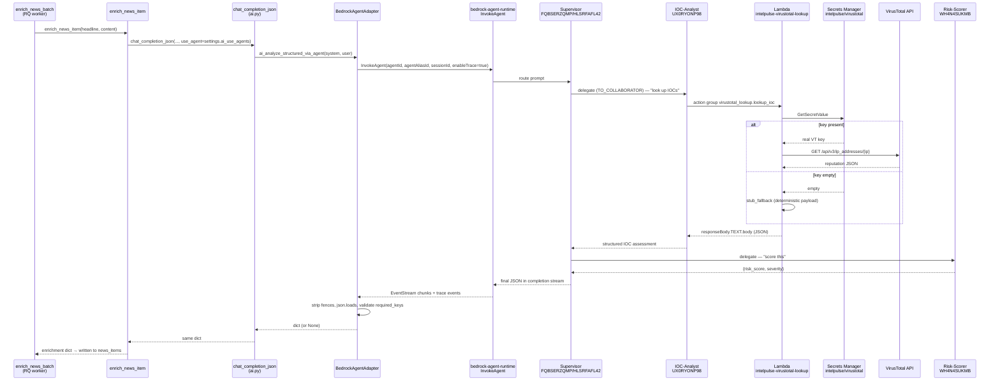

# Multi-Agent Bedrock Architecture — Deep Dive

> **Status:** Live as of 2026-04-17 (commit `6b768a6`). 3 of 4 scoped agents provisioned; VirusTotal action group wired end-to-end.

This document is the reference for how IntelPulse's multi-agent enrichment path actually works in production — what runs on AWS, how a news article flows through it, what it costs, how it fails, and how to roll it back.

For the high-level overview see [`README.md`](../README.md); for the whole-platform architecture see [`ARCHITECTURE.md`](ARCHITECTURE.md).

---

## 1. Overview

The enrichment of a news article can take one of two paths, selected by the `AI_USE_AGENTS` feature flag:

| Flag | Path | Components |
|------|------|------------|
| `AI_USE_AGENTS=false` (default) | Single-shot | `BedrockAdapter` → `bedrock-runtime.InvokeModel` on `amazon.nova-lite-v1:0` |
| `AI_USE_AGENTS=true` | **Multi-agent** | `BedrockAgentAdapter` → `bedrock-agent-runtime.InvokeAgent` → Supervisor → (IOC-Analyst → Lambda → VirusTotal/Stub) → Risk-Scorer → final JSON |

Only `enrich_news_item` passes the flag through — briefings, intel search enrichment, IOC demo, and health checks all stay on the single-shot path regardless of the flag.

The multi-agent path is enabled by two runtime files:

- [`api/app/services/bedrock_agent_adapter.py`](../api/app/services/bedrock_agent_adapter.py) — the new adapter
- [`api/app/services/ai.py`](../api/app/services/ai.py) — routes at `chat_completion_json` when `use_agent=True`

---

## 2. Agent Catalog

All three agents run on `amazon.nova-lite-v1:0` in `us-east-1`, account `604275788592`.

### Supervisor — `IntelPulse-Threat-Analyst`

| Field | Value |
|-------|-------|
| Agent ID | `FQBSERZQMP` |
| Alias (ID) | `live-v2` (`HLSRFAFL42`) |
| Foundation model | `amazon.nova-lite-v1:0` |
| Collaboration mode | `SUPERVISOR_ROUTER` |

**Purpose.** Receives the enrichment prompt, plans which specialist to delegate to, synthesizes their responses into the final structured JSON. In `SUPERVISOR_ROUTER` mode the supervisor routes one request to one collaborator at a time (cheaper than full planning mode; fits news-enrichment's one-article-at-a-time pattern).

**Collaborators wired (`TO_COLLABORATOR`):**

- IOC-Analyst (alias `SFDO1GO27Y`)
- Risk-Scorer (alias `BP6KQNKDUB`)

**Inputs.** `inputText` containing system instructions + the news article (title, source, published date, tags, first 10 000 chars of body).

**Outputs.** Structured JSON via the completion EventStream. Must contain `category`, `summary`, `executive_brief` for the caller to accept the enrichment (other 27 news-enrichment fields are best-effort).

---

### IOC Reputation Analyst — `IntelPulse-IOC-Analyst`

| Field | Value |
|-------|-------|
| Agent ID | `UX0RYONP98` |
| Alias (ID) | `live` (`SFDO1GO27Y`) |
| Foundation model | `amazon.nova-lite-v1:0` |
| Collaboration mode | Collaborator (no sub-agents) |
| Action groups | `virustotal_lookup` |

**Purpose.** Given an IOC (IP, domain, or hash) mentioned in the news article, call the `virustotal_lookup` action group, read the reputation data, and return a structured assessment (`reputation`, `threat_associations`, `mitre_techniques`, `confidence`).

**Inputs.** IOC value + type (picked by the Supervisor from the article).

**Outputs.** Structured JSON with reputation assessment.

---

### Risk Scorer — `IntelPulse-Risk-Scorer`

| Field | Value |
|-------|-------|
| Agent ID | `WH4N4SUKMB` |
| Alias (ID) | `live` (`BP6KQNKDUB`) |
| Foundation model | `amazon.nova-lite-v1:0` |
| Collaboration mode | Collaborator (no sub-agents) |
| Action groups | *(none)* |

**Purpose.** Pure reasoning — takes the Supervisor's accumulated context + IOC-Analyst output and produces a quantitative risk score (0–100), severity bucket (CRITICAL/HIGH/MEDIUM/LOW), and a one-sentence rationale.

**Inputs.** Aggregated threat assessment so far.

**Outputs.** `{risk_score, severity, confidence, rationale}` JSON.

---

### Deferred — Threat Context Enricher

Not yet provisioned. Planned for a follow-up PR. Will map IOC-Analyst output to MITRE ATT&CK techniques using a Bedrock Knowledge Base rooted on an S3 bucket containing `enterprise-attack.json`. Requires separate S3 + KB + embeddings-model work; kept out of this PR to keep scope shippable.

---

## 3. Action Group: `virustotal_lookup`

### Function contract

The supervisor invokes the action group as a single function `lookup_ioc(ioc, ioc_type)`.

```jsonc
{
  "name": "lookup_ioc",
  "description": "Query VirusTotal for reputation data on an IOC.",
  "parameters": {
    "ioc":      { "type": "string", "required": true, "description": "IP, domain, or file hash" },
    "ioc_type": { "type": "string", "required": true, "description": "'ip' | 'domain' | 'hash' (md5/sha1/sha256 all accepted as 'hash')" }
  }
}
```

Schema is defined in [`infra/scripts/provision_bedrock_action_group.py`](../infra/scripts/provision_bedrock_action_group.py).

### Lambda

| Field | Value |
|-------|-------|
| Function name | `intelpulse-virustotal-lookup` |
| ARN | `arn:aws:lambda:us-east-1:604275788592:function:intelpulse-virustotal-lookup` |
| Runtime | `python3.12` |
| Memory / timeout | 256 MB / 30 s |
| Handler | `handler.lambda_handler` |
| Source | [`infra/lambdas/virustotal_lookup/handler.py`](../infra/lambdas/virustotal_lookup/handler.py) |
| Dependencies | **stdlib only** (`urllib`, `json`, `os`, `boto3` from runtime) — no `requirements.txt`, no layers |
| Env | `SECRET_ARN` → `intelpulse/virustotal` |
| Exec role | `intelpulse-virustotal-lookup-role` |
| Log group | `/aws/lambda/intelpulse-virustotal-lookup` (14-day retention) |

The handler accepts **two event shapes** (`_extract_params` detects Bedrock via `messageVersion` / `actionGroup` keys):

- **Legacy direct invoke** — `{"ioc": "...", "ioc_type": "..."}` — returns `{"statusCode": 200, "body": "<json>"}`. Preserved for `live_lookup.py` and ad-hoc CLI invokes.
- **Bedrock action-group envelope** — unpacks `parameters[]`, returns the wrapped `{messageVersion, response: {actionGroup, function, functionResponse: {responseBody: {TEXT: {body: "<json>"}}}}}` shape.

### Stub-mode fallback

When `SECRET_ARN` is unset **or** `get_api_key()` returns `""`, the Lambda logs a warning (`virustotal_stub_fallback reason=no_api_key ioc=…`) and returns deterministic synthetic reputation data with a `stub: true` marker:

```json
{
  "source": "virustotal",
  "ioc": "8.8.8.8",
  "ioc_type": "ip",
  "stub": true,
  "malicious_count": 3,
  "suspicious_count": 1,
  "harmless_count": 62,
  "undetected_count": 20,
  "reputation": -5,
  "country": "US",
  "as_owner": "Stub AS 0"
}
```

This keeps the multi-agent flow demoable before a real VirusTotal API key is provisioned. Supplying the key through Secrets Manager silently swaps stubs for real data — no code change needed.

### Supplying a real VirusTotal API key

```bash
aws secretsmanager put-secret-value \
  --secret-id intelpulse/virustotal \
  --secret-string '{"VIRUSTOTAL_API_KEY":"<your-key>"}' \
  --region us-east-1
```

Or set `VIRUSTOTAL_API_KEY` in the env when re-running the provisioning script — it will overwrite the secret.

---

## 4. Request Flow



### Observability

Every call emits two structured log lines:

- `bedrock_invoke_agent_request` — at entry, with `agent_id`, `alias_id`, `session_id`, `caller`, `input_len`
- `bedrock_invoke_agent_response` — at exit, with `chunks`, `action_group_invocations`, `collaborator_invocations`, `raw_len`

Grep either line to confirm traffic is flowing through the agent path:

```bash
ssh intelpulse2 "docker logs intelpulse-worker-1 | grep bedrock_invoke_agent_request | tail -20"
```

---

## 5. Cost & Latency

Rough per-article estimates for the multi-agent path vs the single-shot path:

| Metric | Single-shot (`invoke_model`) | Multi-agent (`invoke_agent`) |
|--------|------------------------------|-------------------------------|
| Bedrock calls | 1 | 3–5 (supervisor planner + 1–2 collaborator rounds + final synthesis) |
| Lambda invocations | 0 | 0–1 (only when Supervisor decides IOC lookup is needed) |
| Secrets Manager reads | 0 | 0–1 |
| External API calls | 0 | 0–1 (VirusTotal — if key set + IOCs present) |
| Wall-clock latency | 3–8 s | **10–30 s** (3–5× slower) |
| USD cost per 1k articles | ~$0.18 | **~$0.90–$1.50** (5–8× more) |

Primary cost drivers: supervisor planner tokens + collaborator round-trip tokens dominate. Lambda + Secrets Manager + VirusTotal are negligible at this volume (free tier VT = 500/day).

---

## 6. Content Filter Notes

Nova Lite's built-in content filter refuses ~20% of cybersecurity-focused articles that describe exploit chains, threat-actor TTPs, or C2 infrastructure in detail (per incident `rca_ai_enrichment_silent_failure.md`, 2026-04-17).

**What refused requests look like.** The agent returns a short refusal string instead of structured JSON; `chat_completion_json` parses as non-JSON → returns `None` → the worker skips the item without writing `ai_enriched=true`.

**Mitigation already in place.** The `re_enrich_fallback_news` scheduled task retries items that came back with empty or short summaries, on the assumption that a follow-up attempt with slightly different phrasing sometimes sneaks through.

**Flag interaction.** The agent path is subject to the same content filter. If the flag is ON and a specific article refuses, disabling the flag and re-enriching via single-shot might succeed (different prompt shape may evade the filter) — but this is not automated.

---

## 7. Failure Modes

| What breaks | Where it surfaces | Recovery |
|-------------|-------------------|----------|
| Agent returns malformed JSON | `_parse_json` returns `None` → caller sees `None` → worker skips the item | No retry — item remains `ai_enriched=false`, scheduled re-enrichment picks it up later |
| Agent returns JSON missing `required_keys` | Adapter logs `bedrock_agent_missing_required_keys`, returns `None` | Same as above |
| Agent stream emits error event (validation/throttling/access/quota) | `_drain_stream` raises `RuntimeError` with the event key + message | Worker sees the exception and populates `failed_job_registry` (per `rca_rq_tasks_must_raise`) — operator sees failed jobs in Redis |
| Agent stream emits `returnControl` event | Adapter raises `RuntimeError("…not implemented")` | All action groups are configured `lambda`-mode in this PR; seeing this means an agent config regression — investigate the action group executor |
| `ThrottlingException` on `InvokeAgent` | Adapter retries once with the same session ID | If the second attempt fails the original error propagates |
| Lambda times out (>30 s) | Action group returns an error body to the agent; agent proceeds with best-effort reasoning | Agent final response will note the missing reputation data |
| VirusTotal rate-limit (real key, too many calls) | Lambda wraps `HTTP 429: ...` in `responseBody.TEXT.body` `"error"` key | Agent sees the error in tool output and proceeds with degraded confidence |
| No VT API key (stub mode) | Lambda logs `virustotal_stub_fallback`, returns synthetic data with `stub: true` | No action — stub mode is intentional for demo |
| Agent output cap (1024 tokens) truncates JSON | Parse fails for articles with long 30-field JSON | **Known limitation** — the 3 required fields fit comfortably; extra fields may be missing. See §10 for the fix. |
| EC2 IAM role lacks `bedrock-agent:*` perms | `AccessDeniedException` on first invocation | Already granted via `AmazonBedrockFullAccess` on `BedrockAccessRole` |

---

## 8. Rollback

**Fast rollback (flip flag off):**

```bash
ssh intelpulse2 "sed -i '/^AI_USE_AGENTS=/d' /home/ubuntu/IntelPulse/.env && \
                 cd /home/ubuntu/IntelPulse && docker compose restart worker scheduler"
```

This puts news enrichment back on single-shot `invoke_model` within ~15 s. No data loss — articles already enriched via the agent path stay enriched; new articles route the old way.

**Full teardown of AWS resources** (not recommended — the agents are useful even when the flag is off):

```bash
aws lambda delete-function --function-name intelpulse-virustotal-lookup --region us-east-1
aws iam delete-role-policy --role-name intelpulse-virustotal-lookup-role --policy-name SecretsManagerRead
aws iam detach-role-policy --role-name intelpulse-virustotal-lookup-role \
  --policy-arn arn:aws:iam::aws:policy/service-role/AWSLambdaBasicExecutionRole
aws iam delete-role --role-name intelpulse-virustotal-lookup-role
aws secretsmanager delete-secret --secret-id intelpulse/virustotal \
  --force-delete-without-recovery --region us-east-1
aws logs delete-log-group --log-group-name /aws/lambda/intelpulse-virustotal-lookup --region us-east-1
# Then in the Bedrock Agents console: delete the virustotal_lookup action group from IOC-Analyst
# and re-prepare + bump alias to a version without it.
```

Or re-run [`infra/scripts/provision_bedrock_action_group.py`](../infra/scripts/provision_bedrock_action_group.py) after removing the action-group step to reverse-engineer the mutation — the script is idempotent, not reversible.

---

## 9. Enabling in Production

```bash
# 1. Toggle the flag
ssh intelpulse2 "echo 'AI_USE_AGENTS=true' >> /home/ubuntu/IntelPulse/.env && \
                 cd /home/ubuntu/IntelPulse && docker compose restart worker scheduler"

# 2. Watch for traffic (5–15 min after scheduler's next enrich cycle)
ssh intelpulse2 "docker logs intelpulse-worker-1 --tail 500 --follow | grep -E 'bedrock_invoke_agent_(request|response)'"

# 3. Confirm enrichment landed
ssh intelpulse2 "docker exec intelpulse-postgres-1 psql -U ti_user -d threat_intel -c \
  \"SELECT count(*) FILTER (WHERE ai_enriched) AS enriched_total FROM news_items;\""

# 4. Read the Bedrock trace for one article (session_id is logged per call)
ssh intelpulse2 "docker logs intelpulse-worker-1 | grep 'session_id=news-enrich-' | tail -3"
```

**Expected log pattern per article:**

```text
bedrock_invoke_agent_request agent_id=FQBSERZQMP alias_id=HLSRFAFL42 session_id=news-enrich-<uuid> caller=news_enrichment input_len=N
bedrock_invoke_agent_response chunks=K action_group_invocations=0-1 collaborator_invocations=0-N raw_len=M
```

If `action_group_invocations=0` across all articles, the Supervisor may not be detecting IOCs in the text — tune via the agent's instruction or pass IOC hints in the user prompt.

---

## 10. Future Work

Kept deliberately out of scope for the first PR:

- **Bump agent inference config** — the default `maximumLength=1024` truncates long news JSON. Overriding requires setting `promptCreationMode=OVERRIDDEN` and providing a full `basePromptTemplate`. Pattern goes into a new step of `provision_bedrock_action_group.py`.
- **Deploy the other 3 Lambdas** — `intelpulse-abuseipdb-check`, `intelpulse-otx-lookup`, `intelpulse-shodan-lookup` are coded in `infra/lambdas/` but not deployed. Each needs the same dual-event-shape shim that VirusTotal got (apply the pattern from `virustotal_lookup/handler.py`), plus a Secrets Manager entry per API key. Then register each as an additional action group on IOC-Analyst and re-prepare.
- **Threat Context Enricher agent** — create the 4th agent, upload `enterprise-attack.json` to an S3 bucket, create a Bedrock Knowledge Base over it, wire the KB to the new agent, add it as a third collaborator on the Supervisor.
- **Real VirusTotal API key** — replace the empty secret via `aws secretsmanager put-secret-value` (see §3). The Lambda silently switches from stub to real data.
- **Client-side tool dispatch** — if future sub-agents need tools that are better-implemented in Python (e.g. querying local PostgreSQL), switch the action-group executor to `RETURN_CONTROL` and implement the `returnControl` branch in `_drain_stream` that currently raises. Today's raise is defense-in-depth against misconfiguration.
- **Per-article IOC extraction before supervision** — right now the Supervisor reads the whole article and decides whether to look up IOCs. Pre-extracting IOCs in Python and passing only the list to the agent would cut tokens ~30% and make action-group invocations more reliable.
